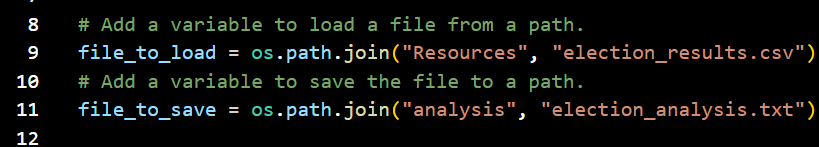

# Election_Analysis

## Project Overview
A Colorado Board of Elections employee has given the following tasks to complete the election audit of a recent local congressional election.

1. Calculate the total number of votes cast.
2. Get a complete list of candidates who received votes.
3. Calculate the total number of votes each candidate received.
4. Calculate the percentage of votes each candidate won.
5. Determine the winner of the election based on popular vote.
6.  The voter turnout for each county
7. The percentage of votes from each county out of the total count
8. The county with the highest turnout

## Resources
- Data Source: election_results.csv
- Software: Python 3.7.6, Visual Studio Code 1.66.2

## Results
The analysis of the election show that:
- There were 369,711 votes cast in the election
- The candidates were:
    - Charles Casper Stockham
    - Diana DeGette
    - Raymon Anthony Doane
- The candidate results were:
    - Charles received 23% of the vote and 85,213 number of votes
    - Diane received 73.8% of the vote and 272,892 number of votes
    - Raymon received 3.1% of the vote and 11,606 number of votes
- The winner of the election was:
    - Diane, who recieved 73.8% of the vote and 272,892 number of votes
- The counties were:
    - Jefferson
    - Denver
    - Arapahoe
- The county results were:
    - Jefferson received 10.5% of the vote and 38,855 number of votes
    - Denver received 82.8% of the vote and 306,055 number of votes
    - Arapahoe received 6.7% of the vote and 24,801 number of votes
- The county with the largest number of votes was:
    - Denver, who recieved 82.8% of the vote and 306,055 number of votes

## Summary
Overall, this script can be used in other elections to show breakdown winners natioanlly or locally. A few ways this script can be modified for other elections is by:
1. Replacing the data source name in the exisitng code to whatever name the new source will be
2. Changing the file path to match that of the new data source so that it will load and save properly. Example below of what to change

3. Either making sure the columns/rows line up to fit the code, or by changing the following lines to fit the new dataset:
```
 # Get the candidate name from each row.
 candidate_name = row[2]

 # Extract the county name from each row.
 county_name = row[1]
 
 ```
 4. Lastly, if it is a country wide election, change "county" to "state" in things like varibles, lists, and dictionaries.
